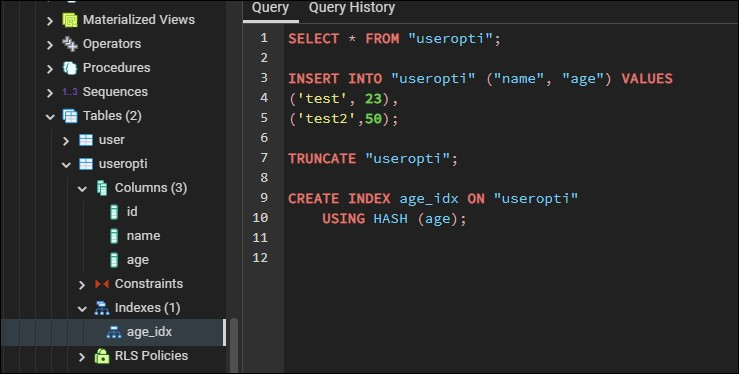
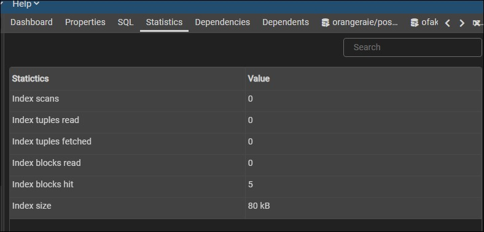
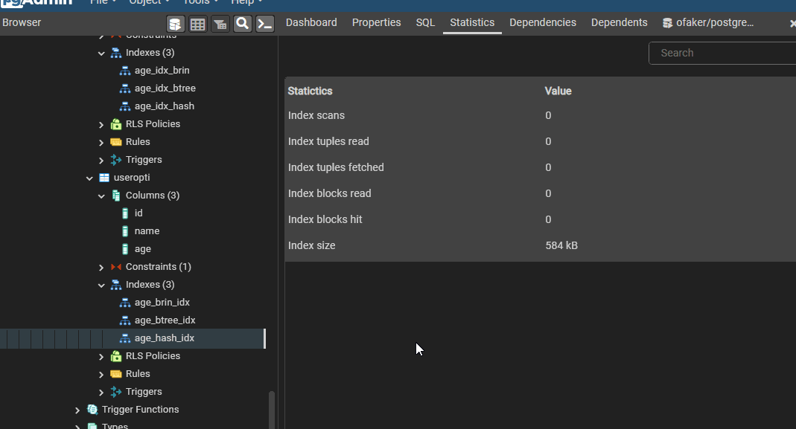
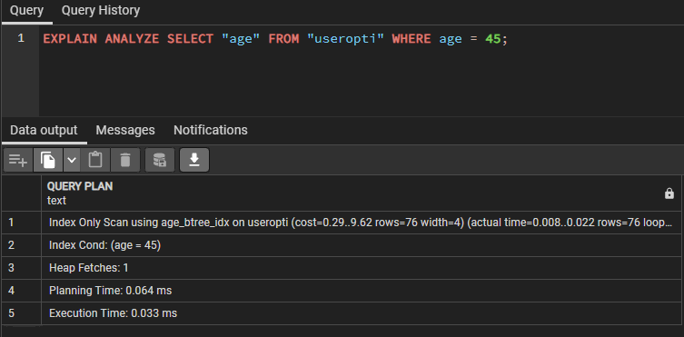

<h1 style="color:white; background-color: #B8FFF9; text-align:center; padding: 10px; width: auto; border-radius:2rem; box-shadow: rgba(0, 0, 0, 0.4) 0px 2px 4px, rgba(0, 0, 0, 0.3) 0px 7px 13px -3px, rgba(0, 0, 0, 0.2) 0px -3px 0px inset; font-weight:900; letter-spacing: 0.2rem; margin-bottom:1rem;"> CREATE INDEX </h1>

## Types d'index
<https://www.postgresqltutorial.com/postgresql-indexes/postgresql-create-index/>

D'un SGBD à l'autre, ce n'est pas toujours le même algorithme d'indexation qui est utilisé. La plupart des SGBD propose d'ailleurs plusieurs types.

Les 3 plus populaires sont :

- B-tree
- Hash
- Brin

## Syntaxe

```sql
CREATE [ UNIQUE ] INDEX [ CONCURRENTLY ] [ [ IF NOT EXISTS ] _`name`_ ] ON [ ONLY ] _`table_name`_ [ USING _`method`_ ]
    ( { _`column_name`_ | ( _`expression`_ ) } [ COLLATE _`collation`_ ] [ _`opclass`_ [ ( _`opclass_parameter`_ = _`value`_ [, ... ] ) ] ] [ ASC | DESC ] [ NULLS { FIRST | LAST } ] [, ...] )
    [ INCLUDE ( _`column_name`_ [, ...] ) ]
    [ WITH ( _`storage_parameter`_ [= _`value`_] [, ... ] ) ]
    [ TABLESPACE _`tablespace_name`_ ]
    [ WHERE _`predicate`_ ]
```

```sql
SELECT * FROM "useropti";

INSERT INTO "useropti" ("name", "age") VALUES
('test', 23),
('test2',50);

TRUNCATE "useropti";

--HERE
CREATE INDEX age_idx ON "useropti"
    USING HASH (age);

```



Index take place



# INDEXATION AVEC BRIN

Brin prendra moins de place lors de l'indexation, bat grandement en performance BTree



Pour 10 000 entrées :

```sql
- age_brin_idx = index size 24 KB
CREATE INDEX "age_brin_idx" ON "user" 
USING BRIN (age);
```

```sql
-- age_btree_idx => index size => 88 KB
CREATE INDEX "age_hash_idx" ON "user" (age);
```

```sql
-- age_hash_idx => index size => 584 KB
CREATE INDEX "age_hash_idx" ON "user"
USING HASH (age);
```

Source : <https://stackoverflow.com/questions/24197856/what-is-difference-between-index-and-view-in-mysql>


> **VIEW**
> 
> -   View est une table logique. C'est un objet physique qui stocke les données de manière logique. La vue fait simplement référence aux données qui sont stockées dans les tables de base.
> -   Une vue est une entité logique. Il s'agit d'une instruction SQL stockée dans la base de données du tablespace système. Les données d'une vue sont générées dans une table créée par le moteur de base de données dans l'espace table TEMP.
> 
> **INDEX**
> 
> -   Les index sont des pointres qui correspondent à l'adresse physique des données. Ainsi, en utilisant des index, la manipulation des données devient plus rapide.
> -   Un index est une méthode de réglage des performances permettant une récupération plus rapide des enregistrements. Un index crée une entrée pour chaque valeur qui apparaît dans les colonnes indexées.
> 
> **ANALOGIE** :
> 
> Supposons que dans un magasin, supposons que vous ayez plusieurs racks. Catégoriser chaque rack en fonction des éléments enregistrés revient à créer un index. Ainsi, vous sauriez exactement où chercher pour trouver un élément particulier. C'est l'indexation.
> 
> Dans le même magasin, vous souhaitez connaître plusieurs données, par exemple, les produits, l'inventaire, les données de vente et d'autres éléments sous forme de rapport consolidé, puis il peut être comparé à une vue.
> 

## - VIEW stocke les requêtes complexes

## - INDEX stocke un block de données

## ANALYZE

SANS INDEXATION et AVEC INDEXATION



____

### Tous les types d'index en  PostgreSQL – Types d’index

Source [des différents types ici](https://fr.acervolima.com/postgresql-types-d-index)

Dans cet article, nous examinerons les types d’index dans [PostgreSQL](https://fr.acervolima.com/qu-est-ce-que-postgresql-introduction/) et comment les utiliser de manière appropriée.

PostgreSQL a **6 types d’index principaux** :

- Index  B-Tree
- Index Hash
- Index GIN
- BRIN
- Index GiST
- Index SP-GiST

Discutons-en brièvement.

### Index  B-Tree

B-tree est un arbre à équilibrage automatique qui conserve les données triées et permet des recherches, des insertions, des suppressions et des accès séquentiels en temps logarithmique.

Le planificateur de requests PostgreSQL envisagera d’utiliser un index B-tree chaque fois que des colonnes d’index sont impliquées dans une comparaison qui utilise l’un des opérateurs suivants :

```sql
<
<=
=
>=
BETWEEN
IN
IS NULL
IS NOT NULL
```

De plus, le planificateur de requests peut utiliser un index B-tree pour les requests qui impliquent un opérateur de correspondance de modèle [LIKE](https://www.postgresqltutorial.com/postgresql-like/) et ~ si le modèle est une constante et est ancré au début du modèle.

**Exemple:**

```
column_name LIKE 'foo%' 
column_name LIKE 'bar%' 
column_name  ~ '^foo'
```

De plus, le planificateur de requests envisagera d’utiliser des index B-tree pour [ILIKE](https://fr.acervolima.com/postgresql-operateur-ilike/) et ~* si le motif commence par un caractère non alphabétique qui sont les caractères qui ne sont pas affectés par la conversion majuscule/minuscule.

### Index Hash

Les index de hachage ne peuvent gérer qu’une simple comparaison d’égalité (=). Cela signifie que chaque fois qu’une colonne indexée est impliquée dans une comparaison à l’aide de l’opérateur égal (=), le planificateur de requête envisagera d’utiliser un index de hachage.

Pour créer un index de hachage, vous utilisez l’instruction CREATE INDEX avec le type d’index HASH dans la clause USING comme suit :

**Syntax:

```sql
CREATE INDEX index_name 
ON table_name USING HASH (indexed_column);
```

### Index GIN

GIN signifie **Generalized Inverted Indexes** . Il est communément appelé GIN.

Les index GIN sont particulièrement utiles lorsque plusieurs valeurs sont stockées dans une seule colonne, par exemple, les [types hstore](https://fr.acervolima.com/postgresql-type-de-donnees-hstore/) , [array](https://fr.acervolima.com/postgresql-type-de-donnees-de-array/) , jsonb et range.

### BRIN

BRIN signifie **Block Range Indexes** . BRIN est beaucoup plus petit et moins coûteux à maintenir par rapport à un indice B-tree.

BRIN permet l’utilisation d’un index sur une très grande table qui serait auparavant impossible avec B-tree sans partitionnement horizontal. BRIN est souvent utilisé sur une colonne qui a un ordre de tri linéaire, par exemple, la colonne de date de création de la table des commandes clients.

### Index GiST

GiST signifie **Arbre de recherche généralisé** . Les index GiST permettent de construire des arborescences générales. Les index GiST sont utiles pour l’indexation des types de données géométriques et la recherche en texte intégral.

### Index SP-GiST

SP-GiST signifie **GiST partitionné dans l’espace** . SP-GiST prend en charge les arbres de recherche partitionnés qui facilitent le développement d’un large éventail de différentes structures de données non équilibrées. Les index SP-GiST sont plus utiles pour les données qui ont un élément de clustering naturel et qui ne sont pas non plus une arborescence également équilibrée, par exemple, SIG, multimédia, routage téléphonique et routage IP.
